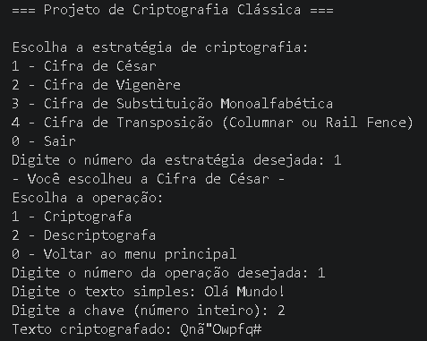

# Projeto Criptografia

Projeto desenvolvido com o objetivo de estudar e implementar algoritmos
clássicos de criptografia, como a Cifra de César, Cifra de Vigenère, Cifra de
Substituição Monoalfabética e Cifra de Transposição (Columnar ou Rail Fence).

## Escolha da linguagem de programação

Escolhemos Python por sua simplicidade, pois o importante nessa atividade são os
conceitos fundamentais de criptografia. Python é a linguagem com entendimento
mais simples, e o grupo já possui alguma experiência com ela. O fato de Python
já possuir em sua stdlib varias bibliotecas de criptografia, também é
importante, pois diminui a complexidade de instalação e preparação de ambiente.

## Aviso de compatibilidade

Este projeto está sendo desenvolvido e validado no ambiente descrito abaixo:

- OS: Windows 11
- Editor: Visual Studio Code (versão 1.122.0 ou superior).
- Shell: Git Bash (via Git for Windows).
- Python versão 3.13.0 ou superior.
- Package manager: pip (via Python). Pip versão 26.0.1 ou superior.

Sendo assim, a compatibilidade com outros sistemas operacionais, shells, IDEs e
configurações de ambiente pode ser limitada.

## Instalação

### Pré-requisitos

- Python 3.13 ou superior.
- pip.
- Git.

### Passos para instalação

1. Clone o repositório e acesse o diretório do projeto:

   ```bash
   git clone https://github.com/Helio505/ProjetoCriptografiaClassica.git
   cd ProjetoCriptografiaClassica
   ```

2. Inicie a aplicação:

   ```bash
   python main.py
   ```

<!-- ## Tecnologias / Docs / Referencias

- [x]()
- Local Docs
  - [x](docs/env-vars.md) -->

<!-- ## Estrutura do Projeto

```
├── docs/              # Documentação do projeto
├── src/               # Código fonte da aplicação
├── tests/             # Testes unitários e de integração
├── main.py            # Ponto de entrada da aplicação
└── README.md          # Documentação basica do projeto
``` -->

## Uso



- A aplicação utiliza um menu no terminal, onde o usuário pode escolher a
  estrategia de criptografia desejada, e em seguida escolher se deseja
  criptografar ou descriptografar um texto.

### Técnicas de Criptografia Implementadas

- [x] Cifra de César
- [x] Cifra de Vigenère
- [ ] Cifra de Substituição Monoalfabética
- [ ] Cifra de Transposição (Columnar ou Rail Fence)
